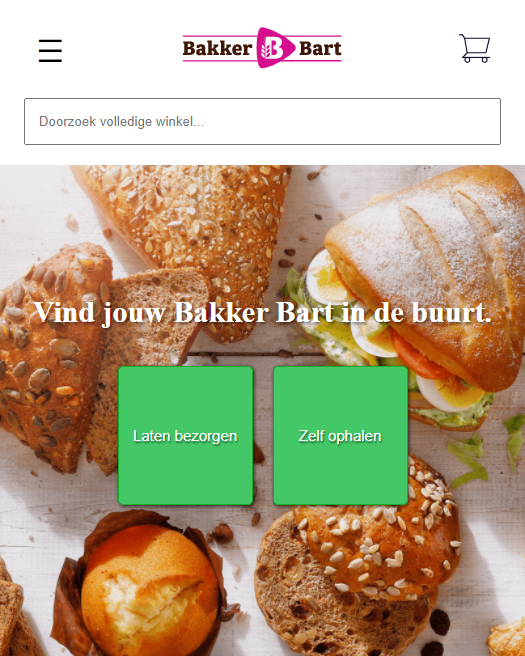
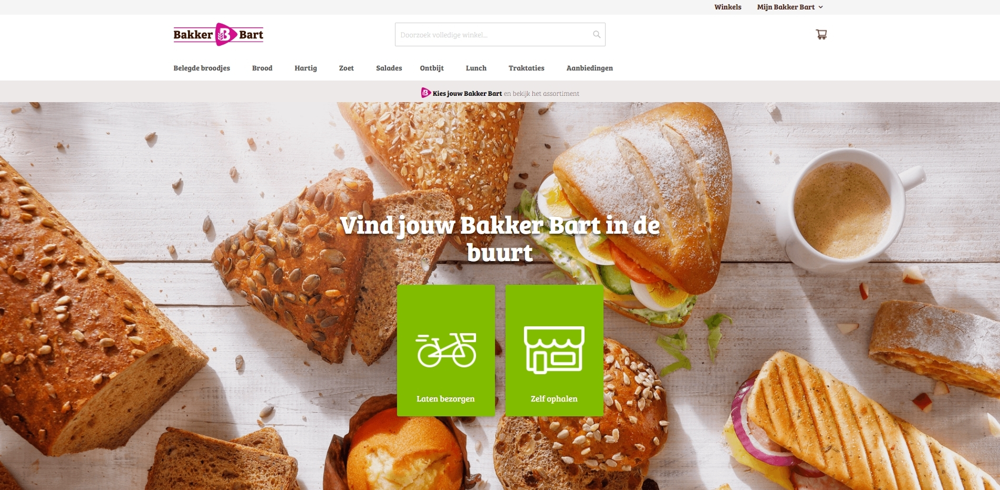
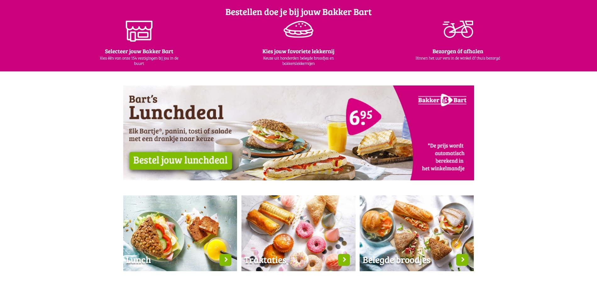
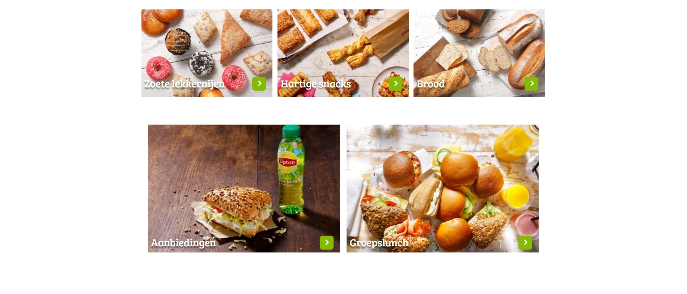
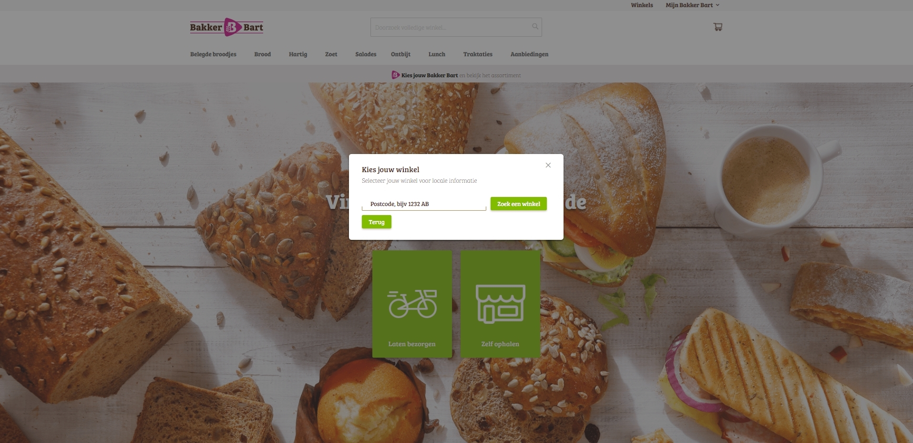
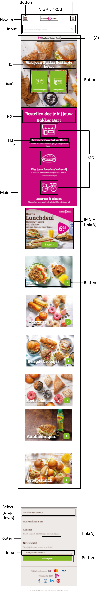

# Procesverslag
**Auteur:** Ryan van Oudenaarde

Markdown cheat cheet: [Hulp bij het schrijven van Markdown](https://github.com/adam-p/markdown-here/wiki/Markdown-Cheatsheet). Nb. de standaardstructuur en de spartaanse opmaak zijn helemaal prima. Het gaat om de inhoud van je procesverslag. Besteedt de tijd voor pracht en praal aan je website.

## Bronnenlijst
1. https://www.bakkerbart.nl/
2. https://stackoverflow.com/
3. https://www.w3schools.com/charsets/ref_utf_symbols.asp

## Eindgesprek (week 7/8)

-dit ging goed & dit was lastig-

**Screenshot(s):**

-screenshot(s) van je eindresultaat-

## Voortgang 3 (week 6)

### Stand van zaken

Bij het derde voortgansgesprek was mijn vooruitgang helaas weer wat langzamer gegaan. Dit komt omdat ik simpelweg sneller meer tijd in FED had moeten stoppen. Ik raak nogal snel gestresd door dingen waardoor ik haast een beetje vastloop. Dat was helaas voor dit gesprek ook gebeurd. Ik had dus wel vooruitgang gemaakt ten opzichte van het vorige gesprek, maar er was nog erg veel te doen.

**Screenshot(s):**

### Verslag van meeting

Tijdens het gesprek kreeg ik te horen dat mijn html en css er in het algemeen netjes uitzagen. Er waren alleen nog wel wat dingen die ik kon doen om het te verbeteren natuurlijk. Die dingen waren bijvoorbeeld:
* Ik hoef geen div te gebruiken voor de heroimage, dit kan namelijk al met een section gedaan worden
* Sommige dingen in de css konden nog wat netter, zo hoefde ik bijvoorbeeld als ergens een waarde 0 was er geen eenheid achter te zetten (dus niet: "0px", maar gewoon: "0")
* Bij het input field kan nog een label toegevoegd worden
* Voor de header afbeelding kan ik gebruik maken van viewport units

## Voortgang 2 (week 5)

### Stand van zaken

Bij het tweede voortgangsgesprek had ik wel al een beginnetje aan mijn site kunnen maken om feedback op te kunnen verzamelen. Het was me al redelijk gelukt om een simpele
header te maken en ik was bezig om mijn header/hero image met tekst en buttons goed te positioneren. Tijdens deze feedbacksessie heb ik hier dan ook vragen over gesteld om te kijken hoe ik dit het beste aan kon pakken.

**Screenshot(s):**

Na de tweede feedbacksessie ben ik vergeten om screenshots maken. Hierna ben ik verder gaan werken aan mijn site waardoor ik helaas niet meer precies weet hoe de oudere versie er uit zag.

### Verslag van meeting

Tijdens de meeting heb ik een aantal handige dingen genoteerd om mij te helpen met de header/hero image. Een aantal van de tips die ik kreeg zijn als volgt:
* Gebruik voor het logo bovenin beeld een max-width van bijv. 300px zodat hij goed meeschaalt en niet te groot wordt
* Voor de header kan je in html een container maken waarop je in css een background image kan zetten. Hier kan je vervolgens background-size en background-position op gebruiken om deze goed neer te ztten.
* Om het input field goed te positioneren kan je hem als display:block gebruiken en vervolgens gewoon margin: auto gebruiken zodat hij in het midden komt. Ten slotte kan je deze ook een max-width meegeven.
* Vergeet niet om: "margin: 0px" toe te voegen bovenin je document

## Voortgang 1 (week 3)

### Stand van zaken

Bij het eerste voortgangsgesprek had ik nog weinig/niet aan mijn site gewerkt.
Dit kwam deels door andere opleveringen en deels omdat ik in de stress was geraakt.
Hierom had ik bij het eerste gesprek nog niets om te laten zien, maar ik was wel aanwezig bij het gesprek om te kijken naar wat mijn klasgenoten hadden gemaakt en om te kijken of zij nog nuttige feedback kregen die ik zelf ook kon gebruiken.

**Screenshot(s):**

Aangezien ik nog heel weinig had voor mijn site had ik hier nog geen screenshots gemaakt

### Agenda voor meeting

-samen met je groepje opstellen-

### Verslag van meeting

Alhoewel ik zelf geen feedback heb kunnen krijgen op mijn werk heb ik wel een aantal annotaties gemaakt vor dingen die ik zelf in gedachte kan houden. Hieronder vallen bijv. dingen als:
* Je hebt voor veel dingen niet per se een div nodig
* Laat in comments zien hoe je bepaalde dingen hebt gedaan
* Met flex box kan je veel dingen handig positioneren

## Intake (week 1)

**Je startniveau:** Blauw

**Je focus:** Responsive

**Je opdracht:** https://www.bakkerbart.nl/

**Screenshot(s):** 

**Breakdown-schets(en):**

